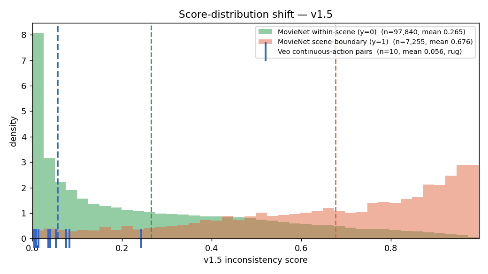
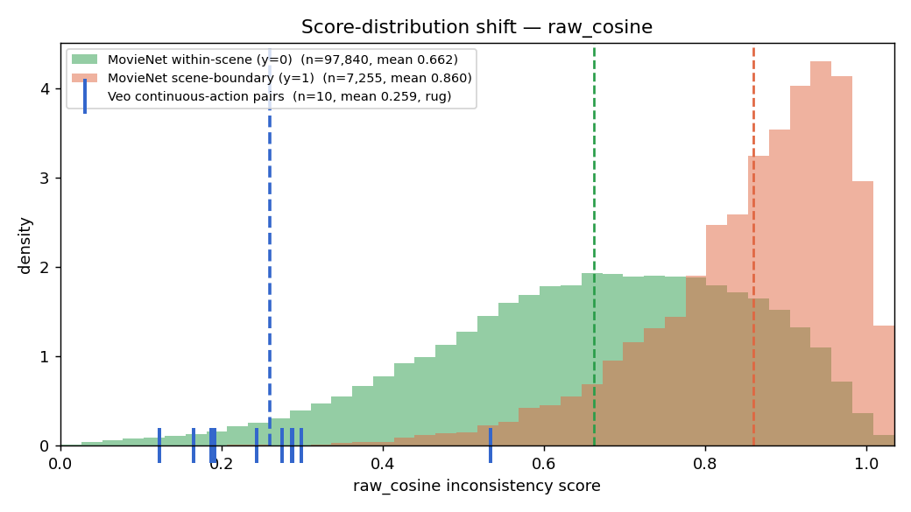

# v1.5 Distribution-Shift Diagnostic

Veo continuous-action pairs (all intended y=0) score far below MovieNet within-scene cuts. This checks whether that is a model failure or a real property of the data, by comparing score distributions across three populations. Scores are **inconsistency** scores (higher = less continuous); raw cosine is 1 − cos(eL, eR) on the boundary keyframes. Produced by `scripts/eval/distribution_shift_diagnostic.py` from cached scores (seed-2 v1.5, MovieNet test split).

## v1.5 MLP

| population | n | mean | median | p90 |
|---|--:|--:|--:|--:|
| MovieNet within-scene (y=0) | 97,840 | 0.265 | 0.184 | 0.663 |
| MovieNet scene-boundary (y=1) | 7,255 | 0.676 | 0.745 | 0.963 |
| Veo continuous-action pairs | 10 | 0.056 | 0.038 | 0.098 |

## raw DINOv2 cosine

| population | n | mean | median | p90 |
|---|--:|--:|--:|--:|
| MovieNet within-scene (y=0) | 97,840 | 0.662 | 0.679 | 0.901 |
| MovieNet scene-boundary (y=1) | 7,255 | 0.860 | 0.888 | 0.988 |
| Veo continuous-action pairs | 10 | 0.259 | 0.259 | 0.323 |

## Where does Veo sit?

Percentile rank = the fraction of MovieNet within-scene cuts that score below the Veo mean.

- **v1.5:** Veo mean 0.056 < within-scene 0.265 < boundary 0.676. The Veo mean lands at the **30th percentile** of within-scene cuts — the lower third, below the within-scene median (0.184) but overlapping the distribution, not a disjoint tail.
- **raw cosine:** Veo mean 0.259 < within-scene 0.662 < boundary 0.860. Here the Veo mean is at only the **3rd percentile** of within-scene cuts — a near-disjoint extreme-similar tail. In cosine-similarity terms the Veo boundary frames are ~0.74 similar vs ~0.34 for real within-scene cuts.
- Mann-Whitney (Veo raw cosine < within-scene raw cosine): p = 3.5e-07.

The two models disagree on *how* extreme the shift is: pure cosine puts Veo at the 3rd percentile, v1.5 at the 30th. v1.5's 2305-d feature (concat + difference, not just cosine) picks up some Veo identity drift that pure similarity misses, so it spreads the Veo pairs higher than cosine alone would — a small point in v1.5's favour.

## Hypothesis: are Veo pairs more visually similar than within-scene cuts?

**Confirmed.** Raw DINOv2 cosine — a pure visual-similarity measure, no training involved — puts the Veo boundary frames at 0.259 mean distance vs 0.662 for MovieNet within-scene cuts. The Veo frames are markedly *more* alike than two shots of one scene in a real film, so v1.5 scoring them low (0.056) is the model behaving correctly, not failing.

## Read

The shift is real and it is in the data, not the model. A Veo continuous-action pair is two clips generated from near-identical prompts — they share setting, lighting, palette and rough framing — so the boundary frames sit very close in embedding space. A real MovieNet within-scene cut joins two genuinely different camera setups (angle, focal length, subject framing), a much larger visual jump. Raw cosine makes this unambiguous: 0.259 vs 0.662 mean distance, with the Veo mean at the 3rd percentile of the within-scene distribution. v1.5 inherits the shift — its Veo mean (0.056) sits well below the within-scene mean (0.265), at the 30th percentile.

The consequence is a calibration problem, not a detection problem. v1.5 is correctly reading the Veo pairs as visually continuous; the MovieNet-derived operating thresholds (val ~0.75, τ99 ~0.65) sit an order of magnitude above the entire Veo distribution, so every Veo pair clears as 'consistent' and nothing — including the identity-drift pairs — gets flagged. For editor-facing use on AI-gen footage the threshold must be set from the AI-gen distribution itself, or flagging must be rank-based (top-k per batch) rather than absolute. The signal to flag identity drift is present in the *ranking* (Experiment 1: ensembles rank both major pairs top-2); it is the absolute scale that does not transfer. This argues for a calibration step on AI-gen data before any editor deployment, and is orthogonal to the v2 architecture question.
